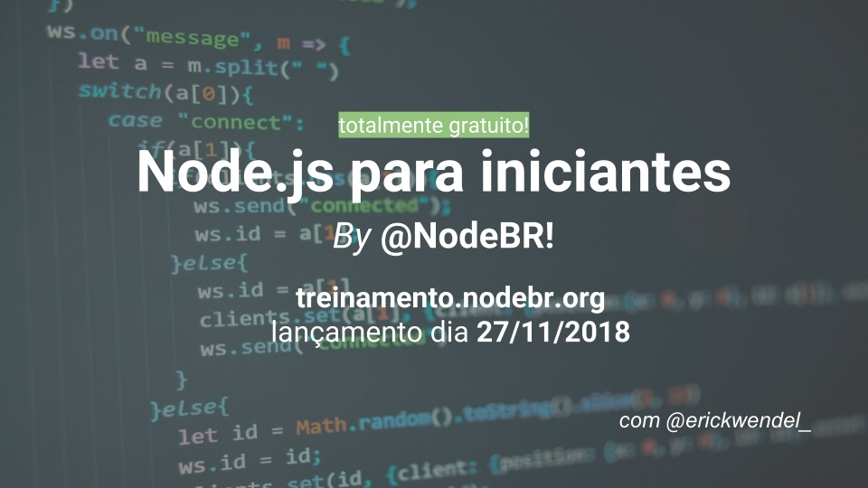

# Bem vindo à Maratona Kubernetes

Inscrições: [https://treinamento.nodebr.org/](https://treinamento.nodebr.org/)

## SOBRE O TREINAMENTO

Varrendo a internet, encontramos diversos treinamentos sobre  **Node.js**  e  **Javascript**. Mas na maioria das vezes estes conteúdos  **são focados na mesma coisa**! A grande maioria fala sobre a Stack  **MEAN**  (MongoDB, Express.js, Angular.js e Node.js), programação para Web ou apenas  **simples CRUDs**  (as operações básicas de sistemas: Cadastrar, Listar, Atualizar e Remover), coisas que para **estudos**  funcionam muito bem, mas a  **realidade**  no dia a dia de desenvolvimento de  **aplicações**  focado em  **produção**  é um pouco **diferente**.

Este treinamento foi  **desenvolvido**  sob medida  **baseado**  em uma pesquisa sobre o que a  **comunidade brasileira mais necessita**, suas principais  **dificuldades**  e  **desafios**. Neste curso você aprenderá desde o básico de Javascript, ciclo de vida, manipulação de listas ao desenvolvimento real de aplicações em ambiente de produção. Na prática você também aprenderá conceitos sobre desenvolvimento orientado a testes, autenticação, autorização, documentação de serviços e gerenciamento de variáveis de ambiente (environments) de aplicações.

## PRÉ-REQUISITOS

Conhecimentos básicos em Git, Linux, DevOps e Cloud irão contribuir para você obter o melhor aproveitamento do treinamento. Saiba mais sobre containers e AKS.
Conta gratuita para desenvolvedores no Azure Free Trial. Você receberá gratuitamente U$ 200,00 em créditos para usar em qualquer produto Azure por 30 dias + 12 meses de acesso à mais de 25 produtos.

## INSTRUTOR

### [Erick Wendel](https://twitter.com/erickwendel_)

Erick Wendel is a Speaker, Software Consultant and community Co-organizer on Brazil. Named by Microsoft as Most Valuable Professional, and by Google as Google Developer Expert a specialist in Node.js, and Javascript Applications. He is  Software Independent Architect where help companies to make better and cheaper applications using Serverless, Container based applications, and Hybrid Cloud solutions. He has experience speaking and teaching on the biggest conferences in Brazil and Americas, working as voluntary Leader of NodeBR, Javascript São Paulo and Nerdzão Communities.

Twitter:  [@erickwendel_](https://twitter.com/erickwendel_)  
Linkedin:  [br.linkedin.com/in/erickwendel](http://br.linkedin.com/in/erickwendel)  
Github:  [github.com/erickwendel](https://github.com/erickwendel)  
Facebook:  [fb.com/page.erickwendel](https://fb.com/page.erickwendel)
Website:  [erickwendel.com](http://erickwendel.com/)

## CONTEÚDO

### Módulo 0  Introdução ao Curso

- Introdução ao Curso e Objetivos
- Tópicos abordados - O que aprenderei ?
- Instalação e Configuração
- Introdução ao Node.js
- Conhecendo o gerenciador de pacotes NPM
- Começando um projeto Node.js

### Módulo 1  Sincronia de Funções Javascript

- Introdução ao Capitulo
- Entendendo o ciclo de vida de aplicações Javascript
- Trabalhando com Callbacks
- Introdução a Promises
- Refatorando Callbacks para Promises
- Introdução a resolução de Promises com async/await
- Resolução de promises com Async/Await
- Introdução à manipulação de eventos com EventEmitter
- Trabalhando com Eventos com a classe EventEmitter

### Módulo 2  Manipulação de Listas

- Introdução ao Capitulo
- Manipulando listas com For/ForIn/ForOf
- Criando nosso proprio Array.Map
- Criando nosso proprio Array.Filter
- Criando nosso proprio Array.Reduce

### Módulo 3  Introdução a desenvolvimento de testes automatizados

- Introdução a desenvolvimento de testes automatizados em Javascript
- Ambiente e configuração do ciclo de testes

### Módulo 4  Node.js além da Web - Criando ferramentas de linha de comando

- Introdução ao Capítulo
- Manipulando arquivos - CREATE
- Manipulando arquivos - READ
- Manipulando arquivos - UPDATE
- Manipulando arquivos - DELETE
- Criando ferramentas de linha de comando com Commander

### Módulo 5  Bancos de Dados - Nosso projeto Multi-banco de dados

- Criando projetos multi-banco de dados
- Trabalhando com o padrão Strategy para Multi DataSources
- Design Patterns - Strategy
- Demonstração multi datasources com strategy design pattern

### Módulo 6  Introdução ao Postgres e Bancos Relacionais

- Introdução ao Postgres e Bancos Relacionais
- Postgres - Operadores e conexão
- Conhecendo o Sequelize
- Cadastrando Heróis - CREATE
- Listando Heróis - READ
- Atualizando Heróis - UPDATE
- Removendo Heróis - DELETE

### Módulo 7  MongoDB e Bancos Não-Relacionais (NoSQL)

- Introdução ao MongoDB e Bancos Não-Relacionais (NoSQL)
- Operadores e conexão
- Conhecendo o Mongoose
- Cadastrando Heróis - CREATE
- Listando Heróis - READ
- Atualizando Heróis - UPDATE
- Removendo Heróis - DELETE

### Módulo 8  Refatorando nosso projeto para bancos de dados multi-schemas

- Refatorando a estratégia de MongoDB para multi-schemas
- Refatorando a estratégia de Postgres para multi-schemas

### Módulo 9  Node.js e Web Services - Criando serviços profissionais com Hapi.js

- Introdução ao Capítulo
- Conhecendo o Módulo HTTP
- Introdução ao Hapi.js
- Criando de estrutura para criação de APIs com Hapi.js
- Entendendo o padrão RestFul para desenvolvimento de APIs
- Cadastrando Heróis - POST
- Listando Heróis - GET
- Atualizando Heróis - PATCH / PUT
- Removendo Heróis - DELETE
- Código fonte do capítulo

### Módulo 10  Documentação de Serviços com Swagger

- Adicionando Swagger ao nosso Serviço

### Módulo 11  Autenticação com Json Web Token

- Introdução ao Capitulo
- Como funciona o Json Web Token?
- Configurando o JWT - plugins, testes e rota de login
- Adicionando Hapi-JWT ao nosso Serviço de herois
- Criando o modulo de autenticação de usuarios e hash de senha com bcrypt

### Módulo 12  Publicação de serviços na Web

- Introdução ao Capitulo
- Trabalhando com multi-environments (development, production)
- Publicação de nossos serviços gratuitamente com Heroku & Heroku toolbelt
- MongoDB online e gratuito com Mongo Lab
- Postgres Gratuito no Heroku
- Trabalhando com PM2 para gerência de apps
- Expondo cobertura de código com istanbul

### Módulo 13  Próximos passos

- O que aprender?